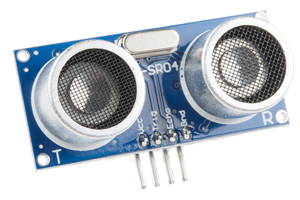

# Mbed OS driver for HC-SR04 ultrasonic distance sensor

This project provides simple IRQ based driver for HC-SR04 ultrasonic distance sensor.



The library is compatible with Mbed OS 6.

## Basic usage

```cpp
#include "mbed.h"

#include "vznncv_hcsr04_driver.h"

using vznncvhcsr04driver::SimpleHCSR04Driver;

/**
 * Configuration
 */
constexpr PinName HCSR04_TRIG_PIN = PB_4;
constexpr PinName HCSR04_ECHO_PIN = PB_5;

/**
 * Main code
 */

int main()
{
    int err;
    float distance = 0.0f;
    static SimpleHCSR04Driver hcsr04_driver(HCSR04_TRIG_PIN, HCSR04_ECHO_PIN);

    // Note: wait a little before first measurement
    ThisThread::sleep_for(50ms);

    while (true) {
        err = hcsr04_driver.measure_distance(&distance);
        printf("measurement: err = %2i, distance = %f\n", err, distance);

        ThisThread::sleep_for(200ms);
    }
    return 0;
}
```

Additional examples can be found in the `examples` folder.
